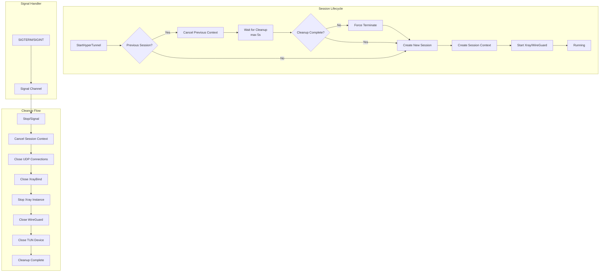

# Design Document: Port Conflict and Zombie Process Fix

## Overview

This design addresses the "bind: address already in use" errors that occur when users restart the VPN quickly or when the app crashes and restarts. The root cause is that old Go routines continue running and holding network ports after a VPN session should have ended.

The solution implements:
1. **Global Session Context** - A `context.Context` with `CancelFunc` that tracks the entire VPN session lifecycle
2. **Force Cleanup on Start** - Automatic cleanup of previous sessions before starting new ones
3. **Signal Handling** - Graceful cleanup on OS signals (SIGTERM, SIGINT)
4. **SO_REUSEADDR** - Socket option for immediate port reuse
5. **Atomic State Management** - Thread-safe start/stop operations

## Architecture



## Components and Interfaces

### 1. SessionManager (New)

A new component to manage VPN session lifecycle with proper cleanup.

```go
// SessionManager manages VPN session lifecycle
type SessionManager struct {
    mu            sync.Mutex
    activeSession *Session
    signalChan    chan os.Signal
}

// Session represents an active VPN session
type Session struct {
    ctx        context.Context
    cancel     context.CancelFunc
    tunnel     *HyperTunnel
    startTime  time.Time
    cleanupWg  sync.WaitGroup
}

// Interface methods
func (sm *SessionManager) Start(config TunnelConfig) error
func (sm *SessionManager) Stop() error
func (sm *SessionManager) ForceStop() error
func (sm *SessionManager) IsRunning() bool
func (sm *SessionManager) GetStats() TunnelStats
```

### 2. Enhanced HyperTunnel

Updates to the existing `HyperTunnel` struct to support context-based cancellation.

```go
type HyperTunnel struct {
    // Existing fields...
    
    // New fields for lifecycle management
    sessionCtx    context.Context
    sessionCancel context.CancelFunc
    cleanupWg     sync.WaitGroup
    cleanupDone   chan struct{}
}
```

### 3. Socket Configuration

Utility functions for setting socket options.

```go
// SetReuseAddr sets SO_REUSEADDR on a socket
func SetReuseAddr(fd int) error

// CreateReuseableListener creates a TCP listener with SO_REUSEADDR
func CreateReuseableListener(network, address string) (net.Listener, error)

// CreateReuseableUDPConn creates a UDP connection with SO_REUSEADDR
func CreateReuseableUDPConn(network, address string) (*net.UDPConn, error)
```

## Data Models

### Session State

```go
type SessionState int

const (
    SessionStateIdle SessionState = iota
    SessionStateStarting
    SessionStateRunning
    SessionStateStopping
    SessionStateStopped
)
```

### Cleanup Result

```go
type CleanupResult struct {
    Success       bool
    Duration      time.Duration
    ResourcesClosed []string
    Errors        []error
    ForcedStop    bool
}
```

## Correctness Properties

*A property is a characteristic or behavior that should hold true across all valid executions of a system-essentially, a formal statement about what the system should do. Properties serve as the bridge between human-readable specifications and machine-verifiable correctness guarantees.*

### Property 1: Session Restart Cleanup
*For any* existing VPN session, when `Start()` is called again, the previous session SHALL be fully stopped (context cancelled, resources released) before the new session begins.
**Validates: Requirements 1.1, 1.4**

### Property 2: Context Lifecycle
*For any* VPN session, when `Start()` completes successfully, a valid session context SHALL exist, and when `Stop()` completes, that context SHALL be cancelled (Done() channel closed).
**Validates: Requirements 2.1, 2.2**

### Property 3: Goroutine Cleanup Timeout
*For any* goroutine spawned with the session context, when the context is cancelled, the goroutine SHALL exit within 2 seconds.
**Validates: Requirements 2.3**

### Property 4: Port Reuse
*For any* TCP or UDP socket created by the system, after the socket is closed, the same port SHALL be immediately bindable by a new socket.
**Validates: Requirements 4.1, 4.2, 4.3**

### Property 5: Atomic State Management
*For any* sequence of concurrent `Start()` and `Stop()` calls, the tunnel state SHALL remain consistent (no partial states), and only one `Start()` SHALL succeed if called concurrently.
**Validates: Requirements 5.2, 5.3, 5.4**

### Property 6: Resource Cleanup Completeness
*For any* VPN session that is stopped, all tracked resources (UDP connections, XrayBind, gRPC client, WireGuard device, TUN device) SHALL be closed.
**Validates: Requirements 6.1, 6.3, 6.4, 6.5**

### Property 7: Cleanup Timeout Enforcement
*For any* cleanup operation, if cleanup does not complete within 5 seconds, the system SHALL force-terminate remaining resources.
**Validates: Requirements 1.2, 1.3**

## Error Handling

### Error Categories

1. **Cleanup Timeout** - Previous session didn't clean up in time
   - Action: Force terminate and log warning
   - Recovery: Proceed with new session

2. **Port Still In Use** - Port binding fails despite cleanup
   - Action: Retry with exponential backoff (3 attempts)
   - Recovery: Return error if all retries fail

3. **Context Already Cancelled** - Operation attempted on cancelled context
   - Action: Return immediately without error
   - Recovery: Normal flow, operation was already stopping

4. **Resource Leak Detection** - Goroutine count higher than expected after cleanup
   - Action: Log warning with goroutine dump
   - Recovery: Continue but flag for investigation

### Error Codes

```go
const (
    ErrCleanupTimeout     = -40  // Previous session cleanup timed out
    ErrPortStillInUse     = -41  // Port binding failed after cleanup
    ErrForceStopRequired  = -42  // Had to force stop previous session
)
```

## Testing Strategy

### Dual Testing Approach

This implementation requires both unit tests and property-based tests:

- **Unit tests** verify specific scenarios like signal handling and timeout behavior
- **Property-based tests** verify universal properties across many random inputs

### Property-Based Testing

We will use **gopter** (Go Property Testing) library for property-based testing.

Each property-based test MUST:
1. Run a minimum of 100 iterations
2. Be tagged with a comment referencing the correctness property
3. Use smart generators that constrain to valid input space

### Test Categories

#### Unit Tests
- Signal handling (SIGTERM, SIGINT)
- Timeout behavior verification
- Cleanup ordering verification
- Error code verification

#### Property-Based Tests
- Session restart cleanup (Property 1)
- Context lifecycle (Property 2)
- Goroutine cleanup timeout (Property 3)
- Port reuse (Property 4)
- Atomic state management (Property 5)
- Resource cleanup completeness (Property 6)
- Cleanup timeout enforcement (Property 7)

### Test Configuration

```go
// Property test configuration
const (
    PropertyTestIterations = 100
    CleanupTimeoutMs      = 5000
    GoroutineExitTimeoutMs = 2000
)
```
