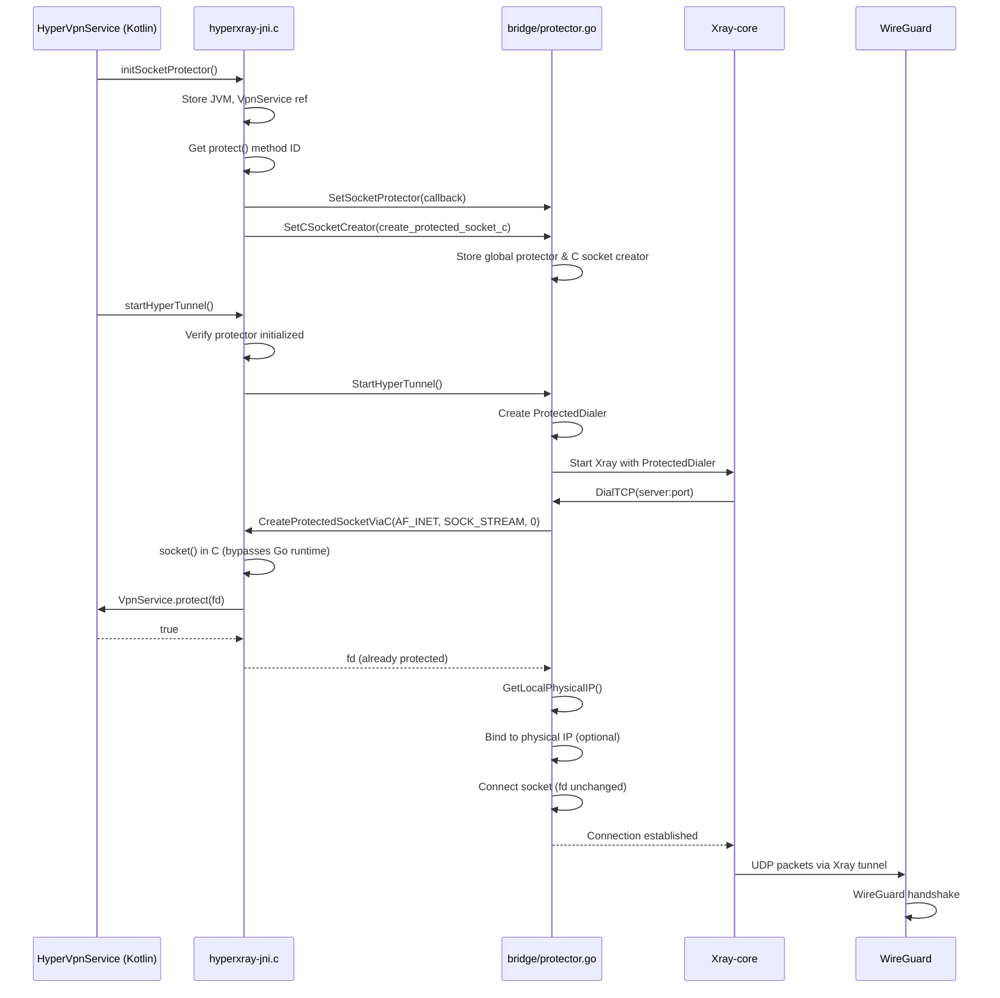

# Design Document: Socket Protection Fix

## Overview

This design addresses the socket protection issues in HyperXray VPN where `VpnService.protect()` is not functioning correctly, causing DNS queries and Xray connections to timeout due to traffic being routed through the wrong network interface.

The fix involves:
1. Ensuring proper initialization order of socket protector before any network operations
2. Adding retry mechanism for protection failures
3. Improving physical interface detection with caching
4. Adding verification mechanism to confirm protection is working
5. Enhanced diagnostic logging for debugging
6. **C-based socket creation to bypass Go runtime interference**

## Critical Issue: Go Runtime Socket Management

When using Go's `syscall.Socket()`, the Go runtime manages the socket in non-blocking mode with its own poller. This can cause issues where:
- The socket fd may be modified or re-opened by Go runtime
- `VpnService.protect(fd)` is called on the original fd, but Go runtime uses a different fd internally
- This results in protection not working correctly

**Solution:** Create sockets directly in C via JNI, protect them immediately, then pass the fd to Go. This bypasses Go runtime's socket management entirely.

## Architecture



### C-Based Socket Creation Flow

The key improvement is that sockets are now created in C and protected before being passed to Go:

```
┌─────────────────────────────────────────────────────────────────┐
│                    OLD FLOW (PROBLEMATIC)                       │
├─────────────────────────────────────────────────────────────────┤
│ Go: syscall.Socket() → fd=10                                    │
│ Go: ProtectSocket(10) → JNI → VpnService.protect(10) ✓          │
│ Go: syscall.Connect(fd, addr)                                   │
│     └─→ Go runtime may re-open socket internally → fd=11       │
│         Protection on fd=10 is useless, fd=11 is unprotected!  │
└─────────────────────────────────────────────────────────────────┘

┌─────────────────────────────────────────────────────────────────┐
│                    NEW FLOW (FIXED)                             │
├─────────────────────────────────────────────────────────────────┤
│ Go: CreateProtectedSocketViaC() → calls C via CGO               │
│ C:  socket(AF_INET, SOCK_STREAM, 0) → fd=10                    │
│ C:  g_protector(10) → JNI → VpnService.protect(10) ✓           │
│ C:  return fd=10 to Go                                          │
│ Go: syscall.Connect(10, addr)                                   │
│     └─→ fd=10 is used directly, no Go runtime interference     │
│         Protection on fd=10 works correctly!                    │
└─────────────────────────────────────────────────────────────────┘
```

## Components and Interfaces

### 1. SocketProtector (JNI Layer)

**File:** `app/src/main/jni/hyperxray-jni/hyperxray-jni.c`

```c
// Enhanced socket protector with retry mechanism
typedef struct {
    JavaVM* jvm;
    jobject vpnService;
    jmethodID protectMethod;
    int maxRetries;
    int retryDelayMs;
    bool initialized;
    bool verified;
} SocketProtectorState;

// Global state
static SocketProtectorState g_protectorState = {
    .jvm = NULL,
    .vpnService = NULL,
    .protectMethod = NULL,
    .maxRetries = 3,
    .retryDelayMs = 100,
    .initialized = false,
    .verified = false
};

// Callback with retry mechanism
bool socket_protector_callback_with_retry(int fd);

// Verification function
bool verify_socket_protection(void);

// C-based socket creation (bypasses Go runtime)
int create_protected_socket_c(int domain, int type, int protocol);
```

### 2. C Socket Creator (JNI Layer - CGO Bridge)

**File:** `app/src/main/jni/hyperxray-jni/hyperxray-jni.c`

```c
// C socket creator - creates socket in C and protects immediately
// This bypasses Go runtime's socket management
static int create_protected_socket_c(int domain, int type, int protocol) {
    // Create socket using C (not Go's syscall.Socket)
    int fd = socket(domain, type, protocol);
    if (fd < 0) return -1;
    
    // Protect immediately before returning to Go
    if (g_protector != NULL && g_protector(fd)) {
        return fd;  // Protected socket fd
    }
    
    close(fd);
    return -1;  // Protection failed
}
```

**File:** `native/bridge/protector.go` (CGO header)

```go
/*
#include <stdlib.h>

typedef int (*c_socket_creator_func)(int domain, int type, int protocol);
static c_socket_creator_func g_c_socket_creator = NULL;

void set_c_socket_creator(c_socket_creator_func creator);
int create_protected_socket_via_c(int domain, int type, int protocol);
int is_c_socket_creator_available();
*/
import "C"

//export SetCSocketCreator
func SetCSocketCreator(creator unsafe.Pointer)

func CreateProtectedSocketViaC(domain, sockType, protocol int) int
func IsCSocketCreatorAvailable() bool
```

### 3. ProtectedDialer (Go Layer)

**File:** `native/bridge/protector.go`

```go
// ProtectedDialer with enhanced error handling
type ProtectedDialer struct {
    Timeout         int           // Connection timeout in seconds
    MaxRetries      int           // Max protection retries
    RetryDelay      time.Duration // Delay between retries
    BindToPhysical  bool          // Whether to bind to physical IP
}

// ProtectionResult contains detailed protection outcome
type ProtectionResult struct {
    Success     bool
    Retries     int
    Error       error
    Interface   string
    PhysicalIP  net.IP
}

// DialTCPWithDiagnostics dials with detailed diagnostics
func (d *ProtectedDialer) DialTCPWithDiagnostics(network, address string) (net.Conn, *ProtectionResult, error)
```

### 3. PhysicalIPCache (Go Layer)

**File:** `native/bridge/protector.go`

```go
// PhysicalIPCache with invalidation support
type PhysicalIPCache struct {
    mu          sync.RWMutex
    ip          net.IP
    iface       string
    timestamp   time.Time
    expiration  time.Duration
    refreshing  bool
}

// Methods
func (c *PhysicalIPCache) Get() (net.IP, string, bool)
func (c *PhysicalIPCache) Set(ip net.IP, iface string)
func (c *PhysicalIPCache) Invalidate()
func (c *PhysicalIPCache) IsExpired() bool
func (c *PhysicalIPCache) RefreshAsync()
```

### 4. ProtectionVerifier (Go Layer)

**File:** `native/bridge/protector.go`

```go
// ProtectionVerifier tests socket protection
type ProtectionVerifier struct {
    TestEndpoint string // e.g., "8.8.8.8:53"
    Timeout      time.Duration
}

// VerificationResult contains test outcome
type VerificationResult struct {
    Success         bool
    ProtectorSet    bool
    ProtectCalled   bool
    ProtectResult   bool
    Error           string
    TestedFd        int
}

// Verify tests socket protection mechanism
func (v *ProtectionVerifier) Verify() *VerificationResult
```

## Data Models

### ProtectionState

```go
type ProtectionState int

const (
    ProtectionStateUninitialized ProtectionState = iota
    ProtectionStateInitialized
    ProtectionStateVerified
    ProtectionStateFailed
)
```

### DiagnosticLog

```go
type DiagnosticLog struct {
    Timestamp   time.Time
    Operation   string // "init", "protect", "dial", "verify"
    Fd          int
    Success     bool
    Error       string
    Interface   string
    PhysicalIP  string
    Duration    time.Duration
}
```

## Correctness Properties

*A property is a characteristic or behavior that should hold true across all valid executions of a system-essentially, a formal statement about what the system should do. Properties serve as the bridge between human-readable specifications and machine-verifiable correctness guarantees.*

### Property 1: Initialization Completeness
*For any* VPN service lifecycle, after `initSocketProtector()` is called, the global protector callback SHALL be non-null and the tunnel start SHALL succeed only if protector is initialized.
**Validates: Requirements 1.1, 5.4**

### Property 2: Protection Before Connect
*For any* socket created by ProtectedDialer, `ProtectSocket(fd)` SHALL be called before `syscall.Connect(fd, addr)`.
**Validates: Requirements 1.2**

### Property 3: DNS Uses Protected Socket
*For any* DNS resolution performed by the system, the underlying socket SHALL be protected before sending DNS query.
**Validates: Requirements 2.1**

### Property 4: DNS Fallback on Failure
*For any* DNS resolution where primary server fails, the system SHALL attempt resolution with fallback servers (8.8.8.8, 1.1.1.1) before returning error.
**Validates: Requirements 2.3**

### Property 5: DNS Cache Round Trip
*For any* DNS entry saved to cache, looking up the same hostname SHALL return the cached IP without network query until TTL expires.
**Validates: Requirements 2.4**

### Property 6: Physical Interface Detection
*For any* interface enumeration, TUN interfaces (tun*, wg*) SHALL be excluded and physical interfaces (wlan*, rmnet*, eth*) SHALL be preferred.
**Validates: Requirements 3.1, 3.2**

### Property 7: Optional Binding Resilience
*For any* dial operation where physical IP lookup fails, the connection attempt SHALL proceed with socket protection only (no binding).
**Validates: Requirements 3.3**

### Property 8: Cache Invalidation
*For any* call to `InvalidatePhysicalIPCache()`, the next `GetLocalPhysicalIP()` call SHALL perform fresh interface detection.
**Validates: Requirements 3.4**

### Property 9: Retry Mechanism
*For any* socket protection that returns false, the system SHALL retry up to 3 times with 100ms delay, and after all retries fail, SHALL return error without attempting connection.
**Validates: Requirements 5.1, 5.2**

### Property 10: Verification Error Specificity
*For any* verification failure, the error message SHALL indicate the specific failure reason (callback null, protect returned false, etc.).
**Validates: Requirements 6.3, 6.4**

## Error Handling

### Error Codes

| Code | Name | Description |
|------|------|-------------|
| -30 | ERR_PROTECTOR_NOT_INIT | Socket protector not initialized |
| -31 | ERR_PROTECT_FAILED | VpnService.protect() returned false |
| -32 | ERR_PROTECT_RETRY_EXHAUSTED | All protection retries failed |
| -33 | ERR_JNI_THREAD_ATTACH | Failed to attach JNI thread |
| -34 | ERR_PHYSICAL_IP_LOOKUP | Physical IP lookup failed (non-fatal) |
| -35 | ERR_VERIFICATION_FAILED | Socket protection verification failed |

### Error Recovery Strategy

1. **Protection Failure**: Retry up to 3 times with exponential backoff
2. **JNI Thread Detach**: Re-attach thread and retry once
3. **Physical IP Lookup Failure**: Continue without binding (protection is sufficient)
4. **Verification Failure**: Log detailed diagnostics and fail tunnel start

## Testing Strategy

### Unit Testing

Unit tests will cover:
- Interface detection logic (filtering TUN interfaces)
- Cache expiration and invalidation
- Retry mechanism timing and count
- Error message formatting

### Property-Based Testing

Property-based tests will use **go-fuzz** or **testing/quick** package to verify:
- Initialization completeness (Property 1)
- Protection call ordering (Property 2)
- DNS fallback behavior (Property 4)
- Cache round-trip (Property 5)
- Interface filtering (Property 6)
- Retry mechanism (Property 9)
- Error specificity (Property 10)

Each property test will:
- Generate random inputs (interface lists, DNS responses, protection results)
- Execute the system under test
- Verify the property holds for all generated inputs
- Run minimum 100 iterations per property

### Integration Testing

Integration tests will verify:
- End-to-end socket protection with mock VpnService
- DNS resolution through protected dialer
- Physical interface detection on real device

### Test Annotations

All property-based tests will be annotated with:
```go
// **Feature: socket-protection-fix, Property 1: Initialization Completeness**
// **Validates: Requirements 1.1, 5.4**
func TestProperty_InitializationCompleteness(t *testing.T) {
    // ...
}
```
