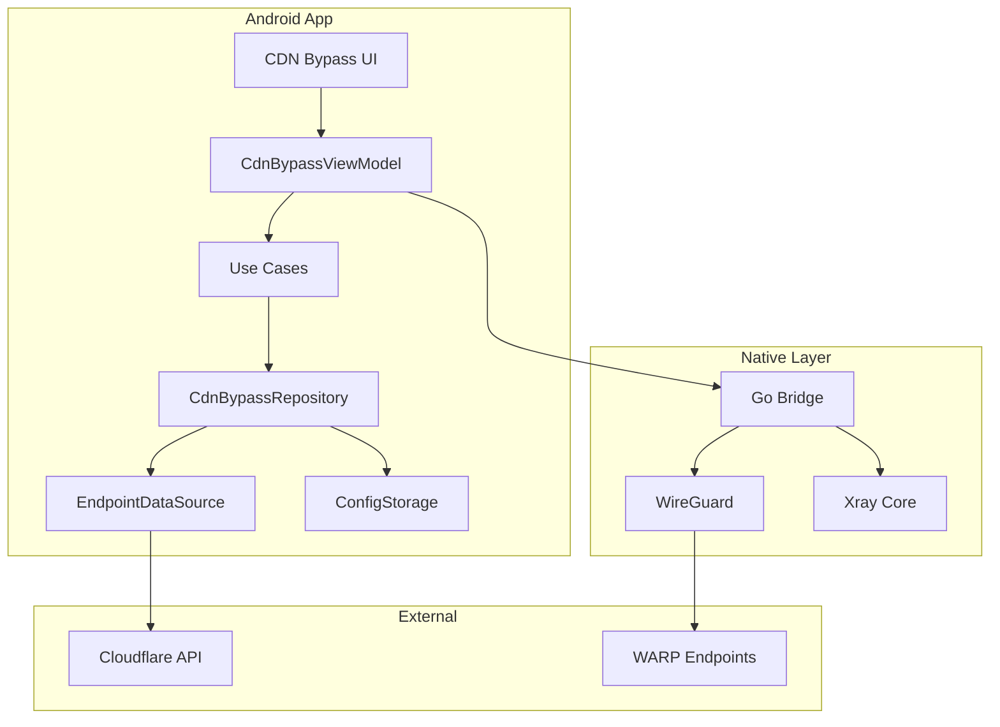

# Design Document: WARP CDN Bypass

## Overview

WARP CDN Bypass özelliği, kullanıcıların Cloudflare WARP bağlantısını kullanarak hedef ülkedeki CDN sunucularına erişmesini sağlar. Bu tasarım, mevcut WARP modülü üzerine inşa edilecek ve hedef ülke bazlı endpoint seçimi, otomatik endpoint keşfi, bağlantı yönetimi ve istatistik izleme yetenekleri ekleyecektir.

Temel yaklaşım:
1. Cloudflare'in anycast WARP endpoint'lerini ülke bazlı gruplandırma
2. Latency tabanlı optimal endpoint seçimi
3. WireGuard tüneli üzerinden trafik yönlendirme
4. Failover mekanizması ile kesintisiz bağlantı

## Architecture



### Layer Responsibilities

1. **Presentation Layer (UI + ViewModel)**
   - Ülke seçimi UI
   - Bağlantı durumu gösterimi
   - İstatistik dashboard

2. **Domain Layer (Use Cases)**
   - SelectTargetCountryUseCase
   - DiscoverEndpointsUseCase
   - ConnectCdnBypassUseCase
   - GetConnectionStatsUseCase

3. **Data Layer (Repository + DataSource)**
   - Endpoint keşfi ve caching
   - Yapılandırma persistence
   - Latency ölçümü

4. **Native Layer (Go Bridge)**
   - WireGuard tünel yönetimi
   - Trafik istatistikleri

## Components and Interfaces

### 1. Data Models

```kotlin
// Hedef ülke modeli
data class TargetCountry(
    val code: String,        // ISO 3166-1 alpha-2 (e.g., "US", "DE", "JP")
    val name: String,        // Display name
    val endpoints: List<WarpEndpoint>
)

// WARP endpoint modeli
data class WarpEndpoint(
    val host: String,        // e.g., "engage.cloudflareclient.com"
    val port: Int,           // e.g., 2408
    val countryCode: String,
    val latencyMs: Long?,    // Measured latency
    val lastTested: Long?    // Timestamp
)

// CDN Bypass yapılandırması
data class CdnBypassConfig(
    val enabled: Boolean,
    val targetCountry: String?,
    val preferredEndpoints: List<String>,
    val autoFailover: Boolean = true,
    val cacheExpiryHours: Int = 24
)

// Bağlantı durumu
sealed class CdnBypassState {
    object Disconnected : CdnBypassState()
    object Connecting : CdnBypassState()
    data class Connected(
        val endpoint: WarpEndpoint,
        val exitIp: String,
        val exitCountry: String
    ) : CdnBypassState()
    data class Error(val message: String) : CdnBypassState()
}

// Bağlantı istatistikleri
data class CdnBypassStats(
    val latencyMs: Long,
    val uploadBytes: Long,
    val downloadBytes: Long,
    val connectedSince: Long,
    val currentEndpoint: String,
    val exitCountry: String,
    val exitIp: String
)
```

### 2. Repository Interface

```kotlin
interface CdnBypassRepository {
    // Ülke yönetimi
    suspend fun getAvailableCountries(): List<TargetCountry>
    suspend fun setTargetCountry(countryCode: String)
    fun getTargetCountry(): String?
    
    // Endpoint yönetimi
    suspend fun discoverEndpoints(countryCode: String): List<WarpEndpoint>
    suspend fun testEndpointLatency(endpoint: WarpEndpoint): Long
    suspend fun getCachedEndpoints(countryCode: String): List<WarpEndpoint>?
    suspend fun cacheEndpoints(countryCode: String, endpoints: List<WarpEndpoint>)
    fun isCacheExpired(countryCode: String): Boolean
    
    // Yapılandırma
    suspend fun saveConfig(config: CdnBypassConfig)
    suspend fun loadConfig(): CdnBypassConfig?
    
    // Bağlantı
    suspend fun connect(endpoint: WarpEndpoint): Result<Unit>
    suspend fun disconnect()
    fun getConnectionState(): Flow<CdnBypassState>
    fun getStats(): Flow<CdnBypassStats>
}
```

### 3. Endpoint Discovery Service

```kotlin
interface EndpointDiscoveryService {
    // Ülke bazlı endpoint listesi
    suspend fun getEndpointsForCountry(countryCode: String): List<WarpEndpoint>
    
    // Latency testi
    suspend fun measureLatency(endpoint: WarpEndpoint): Long
    
    // Toplu latency testi ve sıralama
    suspend fun rankEndpointsByLatency(endpoints: List<WarpEndpoint>): List<WarpEndpoint>
}
```

### 4. Native Bridge Extensions

```go
// Go tarafında eklenmesi gereken fonksiyonlar

// ConnectToEndpoint - Belirli bir endpoint'e bağlan
func ConnectToEndpoint(host string, port int, privateKey string, publicKey string, reserved []byte) error

// GetConnectionStats - Bağlantı istatistiklerini al
func GetConnectionStats() (txBytes uint64, rxBytes uint64, latencyMs int64)

// GetExitInfo - Çıkış IP ve ülke bilgisi
func GetExitInfo() (ip string, country string, err error)

// SwitchEndpoint - Aktif bağlantıyı başka endpoint'e geçir
func SwitchEndpoint(host string, port int) error
```

## Data Models

### Country Endpoint Database

Cloudflare WARP endpoint'leri anycast kullandığından, belirli ülkelere yönlendirme için bilinen endpoint'ler kullanılacak:

```kotlin
object WarpEndpointDatabase {
    // Bilinen WARP endpoint'leri (ülke bazlı)
    val endpoints = mapOf(
        "US" to listOf(
            WarpEndpoint("engage.cloudflareclient.com", 2408, "US", null, null),
            WarpEndpoint("162.159.192.1", 2408, "US", null, null),
            WarpEndpoint("162.159.193.1", 2408, "US", null, null)
        ),
        "DE" to listOf(
            WarpEndpoint("engage.cloudflareclient.com", 2408, "DE", null, null),
            WarpEndpoint("162.159.192.1", 500, "DE", null, null)
        ),
        "JP" to listOf(
            WarpEndpoint("engage.cloudflareclient.com", 2408, "JP", null, null),
            WarpEndpoint("162.159.192.1", 1701, "JP", null, null)
        ),
        // ... diğer ülkeler
    )
    
    val defaultEndpoint = WarpEndpoint(
        "engage.cloudflareclient.com", 2408, "AUTO", null, null
    )
}
```

### Configuration Serialization Format

```json
{
  "enabled": true,
  "targetCountry": "US",
  "preferredEndpoints": [
    "162.159.192.1:2408",
    "162.159.193.1:2408"
  ],
  "autoFailover": true,
  "cacheExpiryHours": 24
}
```

## Correctness Properties

*A property is a characteristic or behavior that should hold true across all valid executions of a system-essentially, a formal statement about what the system should do. Properties serve as the bridge between human-readable specifications and machine-verifiable correctness guarantees.*

Based on the prework analysis, the following correctness properties have been identified:

### Property 1: Country list contains valid country codes
*For any* country in the available countries list, the country code SHALL be a valid ISO 3166-1 alpha-2 code (2 uppercase letters) and have at least one associated endpoint.
**Validates: Requirements 1.1, 1.4**

### Property 2: Country selection persistence round-trip
*For any* valid country code, storing the selection and then retrieving it SHALL return the same country code.
**Validates: Requirements 1.2**

### Property 3: Endpoint discovery returns non-empty results for valid countries
*For any* country code in the supported countries list, endpoint discovery SHALL return at least one endpoint.
**Validates: Requirements 2.1**

### Property 4: Endpoints are sorted by latency in ascending order
*For any* list of endpoints returned after latency testing, the endpoints SHALL be sorted such that each endpoint's latency is less than or equal to the next endpoint's latency.
**Validates: Requirements 2.2**

### Property 5: Cache contains discovered endpoints
*For any* successful endpoint discovery, the cache SHALL contain the same endpoints with their latency measurements.
**Validates: Requirements 2.3**

### Property 6: Cache expiration triggers refresh
*For any* cached endpoint list with timestamp older than 24 hours, accessing the cache SHALL trigger a refresh operation.
**Validates: Requirements 2.5**

### Property 7: Failover selects next best endpoint
*For any* endpoint failure when multiple endpoints are available, the system SHALL select the next endpoint in the latency-ranked list.
**Validates: Requirements 3.4**

### Property 8: Statistics show valid values when connected
*For any* connected state, the statistics SHALL show non-negative latency, non-negative byte counters, and non-empty endpoint address.
**Validates: Requirements 4.1, 4.2, 4.5**

### Property 9: Statistics show exit information when connected
*For any* connected state, the statistics SHALL show non-empty exit country code and non-empty exit IP address.
**Validates: Requirements 4.4**

### Property 10: Configuration serialization round-trip
*For any* valid CdnBypassConfig, serializing to JSON and then deserializing SHALL produce an equivalent configuration object.
**Validates: Requirements 5.1, 5.2, 5.5**

### Property 11: Serialized configuration contains required fields
*For any* CdnBypassConfig, the serialized JSON SHALL contain "targetCountry" and "preferredEndpoints" fields.
**Validates: Requirements 5.3**

### Property 12: Invalid JSON deserialization returns error
*For any* invalid JSON string, deserialization SHALL return an error result without modifying the current configuration.
**Validates: Requirements 5.4**

## Error Handling

### Error Categories

1. **Network Errors**
   - Endpoint unreachable
   - DNS resolution failure
   - Connection timeout
   - TLS handshake failure

2. **Configuration Errors**
   - Invalid country code
   - Missing WARP account
   - Invalid endpoint format

3. **Runtime Errors**
   - Tunnel establishment failure
   - WireGuard handshake failure
   - Permission denied (VPN)

### Error Recovery Strategies

```kotlin
sealed class CdnBypassError {
    data class EndpointUnreachable(val endpoint: String) : CdnBypassError()
    data class NoEndpointsAvailable(val country: String) : CdnBypassError()
    data class TunnelFailed(val reason: String) : CdnBypassError()
    data class ConfigInvalid(val field: String) : CdnBypassError()
    object WarpAccountMissing : CdnBypassError()
}

// Hata durumunda otomatik recovery
class ErrorRecoveryStrategy {
    fun handleError(error: CdnBypassError): RecoveryAction {
        return when (error) {
            is CdnBypassError.EndpointUnreachable -> RecoveryAction.TryNextEndpoint
            is CdnBypassError.NoEndpointsAvailable -> RecoveryAction.UseDefaultEndpoint
            is CdnBypassError.TunnelFailed -> RecoveryAction.RetryWithBackoff
            is CdnBypassError.ConfigInvalid -> RecoveryAction.ResetToDefaults
            CdnBypassError.WarpAccountMissing -> RecoveryAction.PromptRegistration
        }
    }
}
```

## Testing Strategy

### Unit Testing

Unit tests will cover:
- Country code validation
- Endpoint sorting logic
- Configuration serialization/deserialization
- Cache expiration logic
- Error handling paths

### Property-Based Testing

Property-based tests will be implemented using **Kotest** property testing framework for Kotlin.

Each correctness property will have a corresponding property-based test:

1. **Property 1 Test**: Generate random country lists, verify all codes are valid ISO format
2. **Property 2 Test**: Generate random country codes, verify persistence round-trip
3. **Property 3 Test**: For each supported country, verify non-empty endpoint list
4. **Property 4 Test**: Generate random endpoint lists with latencies, verify sorting
5. **Property 5 Test**: Generate random endpoints, verify cache consistency
6. **Property 6 Test**: Generate timestamps, verify expiration logic
7. **Property 7 Test**: Generate endpoint lists with failures, verify failover selection
8. **Property 8 Test**: Generate connected states, verify statistics validity
9. **Property 9 Test**: Generate connected states, verify exit info presence
10. **Property 10 Test**: Generate random configs, verify JSON round-trip
11. **Property 11 Test**: Generate random configs, verify required fields in JSON
12. **Property 12 Test**: Generate invalid JSON strings, verify error handling

### Test Configuration

```kotlin
// Kotest property test configuration
class CdnBypassPropertyTests : StringSpec({
    // Minimum 100 iterations per property
    defaultTestConfig = TestCaseConfig(invocations = 100)
})
```

### Integration Testing

Integration tests will verify:
- End-to-end connection flow
- Native bridge communication
- Real endpoint latency measurement
- Actual tunnel establishment

