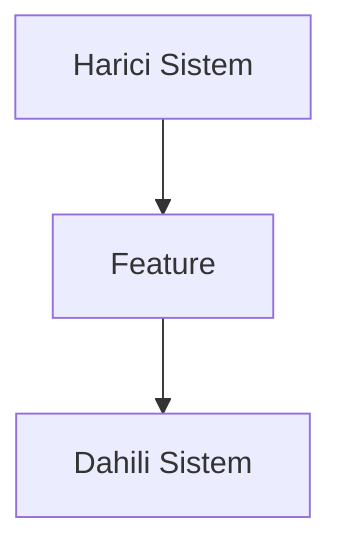

# Design Document

## Document Information
- **Feature Name**: [Feature Adı]
- **Version**: 1.0
- **Date**: [Tarih]
- **Author**: [Yazar]
- **Related Documents**: [requirements.md linki]

## Overview

[Tasarım yaklaşımının üst düzey özeti]

### Design Goals
- [Hedef 1]
- [Hedef 2]

### Key Design Decisions
- [Karar 1 ve gerekçesi]
- [Karar 2 ve gerekçesi]

## Architecture

### System Context
[Feature'ın genel sisteme nasıl uyduğu]



### Technology Stack
| Katman | Teknoloji | Gerekçe |
|--------|-----------|---------|
| UI | Jetpack Compose | Material 3 desteği |
| Business | Kotlin Coroutines | Async işlemler |
| Native | Go + CGO | Xray-core entegrasyonu |

## Components and Interfaces

### Component 1: [Bileşen Adı]

**Purpose**: [Ne yapar]

**Responsibilities**:
- [Sorumluluk 1]
- [Sorumluluk 2]

**Interfaces**:
- **Input**: [Girdi]
- **Output**: [Çıktı]
- **Dependencies**: [Bağımlılıklar]

## Data Models

### Entity: [Entity Adı]

```kotlin
data class EntityName(
    val id: String,
    val property1: String,
    val property2: Int,
    val createdAt: Instant
)
```

**Validation Rules**:
- [Kural 1]
- [Kural 2]

## API Design

### Endpoint: [Endpoint Adı]

**Method**: `POST`
**Path**: `/api/v1/[resource]`

**Request**:
```json
{
  "property1": "string",
  "property2": 123
}
```

**Response**:
```json
{
  "id": "string",
  "status": "success"
}
```

## Security Considerations

### Authentication
- [Kimlik doğrulama yöntemi]

### Data Protection
- [Veri koruma yaklaşımı]

## Error Handling

| Kategori | HTTP Status | Açıklama |
|----------|-------------|----------|
| Validation | 400 | Geçersiz girdi |
| Auth | 401 | Yetkisiz erişim |
| Server | 500 | Sunucu hatası |

## Performance Considerations

### Expected Load
- **Concurrent Users**: [Sayı]
- **Requests/Second**: [Sayı]

### Optimization Strategies
- [Strateji 1]
- [Strateji 2]

## Testing Strategy

### Unit Testing
- **Coverage Target**: 80%+
- **Framework**: JUnit 5 + MockK

### Integration Testing
- [Yaklaşım]

## Design Review Checklist

- [ ] Mimari açıkça tanımlandı
- [ ] Tüm gereksinimler karşılandı
- [ ] Güvenlik değerlendirildi
- [ ] Performans düşünüldü
- [ ] Test stratejisi belirlendi
